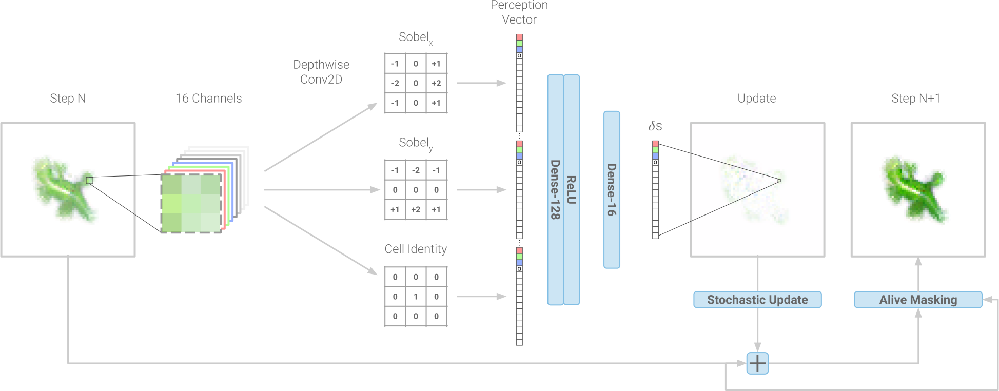

# Neural Cellular Automata (Based on https://distill.pub/2020/growing-ca/) implemented in Jax (Flax)


## How do NCAs work?
For more information, view the awesome article https://distill.pub/2020/growing-ca/ -- Mordvintsev, et al., "Growing Neural Cellular Automata", Distill, 2020

Image below describes a single update step: https://github.com/distillpub/post--growing-ca/blob/master/public/figures/model.svg




## Why Jax?

<b> Note: This project served as a nice introduction to jax, so its performance can probably be improved </b>

NCAs are autoregressive models like RNNs, where new states are calculated from previous ones. With jax, we can make these operations a lot more performant with `jax.lax.scan`  and `jax.jit` (https://jax.readthedocs.io/en/latest/_autosummary/jax.lax.scan.html)

Instead of writing the nca growth process as:

```python
def multi_step(params, nca, current_state, num_steps):
    # params: parameters for NCA
    # nca: Flax Module describing NCA
    # current_state: Current NCA state
    # num_steps: number of steps to run

    for i in range(num_steps):
        current_state = nca.apply(params, current_state)
    return current_state
```

We can write this with `jax.lax.scan`

```python
def multi_step(params, nca, current_state, num_steps):
    # params: parameters for NCA
    # nca: Flax Module describing NCA
    # current_state: Current NCA state
    # num_steps: number of steps to run

    def forward(carry, inp):
        carry = nca.apply({"params": params}, carry)
        return carry, carry

    final_state, nca_states = jax.lax.scan(forward, current_state, None, length=num_steps)
    return final_state
```
The actual multi_step implementation can be found